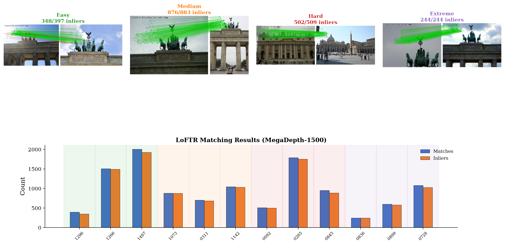
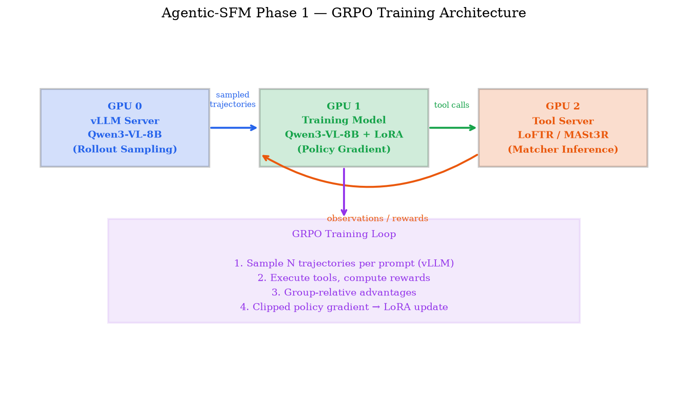
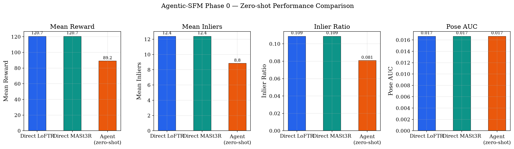
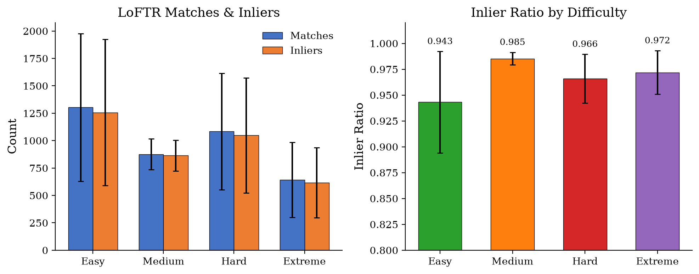
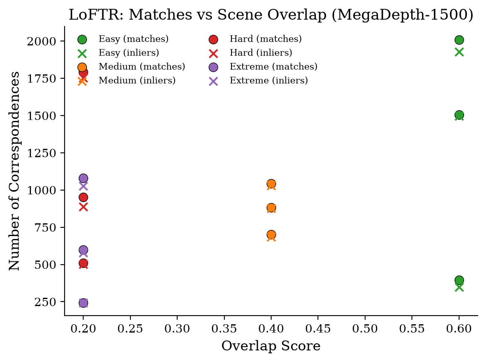
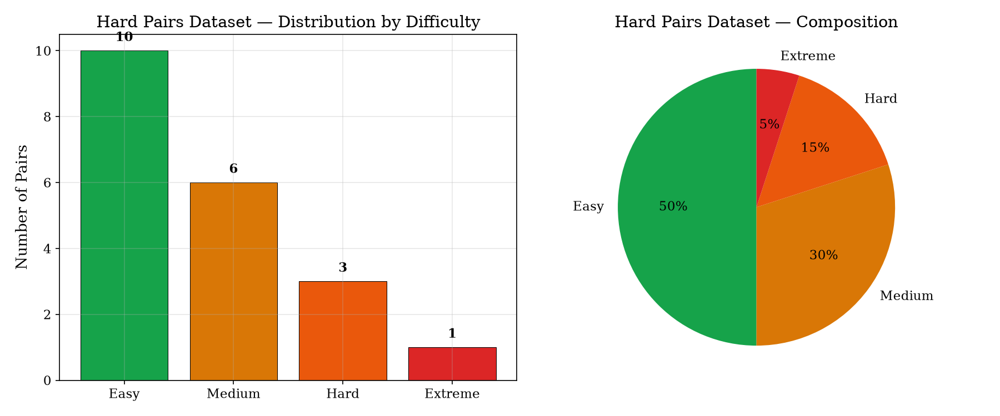

# Agentic SfM

**RL-trained multimodal agents for hard 3D reconstruction.**

Train a vision-language model to orchestrate geometric tools — crop, match, doppelganger filtering, COLMAP — on difficult image pairs where direct matchers fail. Rewards are **verifiable** from ground-truth poses (MegaDepth / COLMAP), not human labels.

<p align="center">
  
</p>

---

## Motivation

Structure-from-motion pipelines break on **hard pairs**: low overlap, extreme viewpoint change, repeated textures, and doppelganger confusion. A frozen matcher cannot adapt its strategy per pair. We treat matching as a **multi-turn decision problem**: an MLLM chooses when to crop, which matcher to call, and when to stop — trained with **GRPO** on pose-accuracy rewards.

## Architecture

```
┌─────────────────────────────────────────────────────────────────┐
│  Qwen3-VL-8B (policy, LoRA r=32)                                │
│  multi-turn JSON tool calls                                     │
└───────────────────────────┬─────────────────────────────────────┘
                            │ HTTP
                            ▼
┌─────────────────────────────────────────────────────────────────┐
│  Tool Server (FastAPI)                                          │
│  crop · match (LoFTR/MASt3R/LightGlue) · doppelganger_check     │
│  retrieve · sfm_run · inspect                                   │
└───────────────────────────┬─────────────────────────────────────┘
                            │ correspondences + pose
                            ▼
┌─────────────────────────────────────────────────────────────────┐
│  Verifiable reward                                              │
│  pose AUC @5°/10°/20° + inlier shaping − tool cost             │
└───────────────────────────┬─────────────────────────────────────┘
                            │ GRPO advantage
                            ▼
┌─────────────────────────────────────────────────────────────────┐
│  Training: custom GRPO loop  OR  VeRL (volcengine/verl)         │
│  Rollout: vLLM  ·  Policy update: FSDP + LoRA                  │
└─────────────────────────────────────────────────────────────────┘
```

<p align="center">
  
</p>

### GPU layout (3× NVIDIA L40S)

| GPU | Role |
|-----|------|
| 0 | vLLM rollout server |
| 1 | FSDP policy training (LoRA) |
| 2 | Matcher inference (tool server) |

## Results (included in repo)

All inference outputs live under [`results/`](results/). See [`results/README.md`](results/README.md) for details.

### Phase 0 — zero-shot feasibility

Does stock Qwen3-VL cropping beat direct matching without RL?

<p align="center">
  
</p>

| Method | Mean inliers | Pose AUC |
|--------|-------------:|---------:|
| Direct LoFTR | 12.4 | 0.017 |
| Direct MASt3R | 12.4 | 0.017 |
| Zero-shot agent | 8.9 | 0.017 |

**Conclusion:** Zero-shot tool use is *worse* than direct matching on hard pairs → RL is required.

### Real MegaDepth inference (12 pairs)

Qualitative match visualizations on scenes `0015` and `0022`:

<p align="center">
  
</p>

<p align="center">
  
</p>

Per-pair overlays: [`results/phase0_real/visualizations/`](results/phase0_real/visualizations/)

## Project phases

| Phase | Status | Description |
|-------|--------|-------------|
| **0** | ✅ Done | Zero-shot crop feasibility + real MegaDepth eval |
| **1** | 🟡 In progress | GRPO on hard-pair matching (custom loop + VeRL integration) |
| **2** | ⬜ Planned | Full agentic SfM (COLMAP, doppelganger, scene rewards) |
| **3** | ⬜ Planned | Benchmark evaluation & write-up |

## Quick start

### Environment

```bash
conda create -n agentic-sfm python=3.11 -y
conda activate agentic-sfm
pip install -e ".[dev,rl]"
```

### 1. Start the tool server

```bash
python tools_server/server.py
# → http://localhost:8765/health
```

Matcher checkpoints (MASt3R / LoFTR / LightGlue) load once per process and are reused across `/match` calls (GPU 2 in the layout above).

### 2. Phase 0 — zero-shot evaluation

```bash
python scripts/run_zeroshot.py --config configs/phase0_zeroshot.yaml
```

### 3. Phase 1 — GRPO training

```bash
# Custom GRPO loop (3-GPU)
sbatch jobs/phase1_grpo.slurm

# VeRL GRPO (experimental)
sbatch jobs/run_verl_grpo_3gpu.slurm
```

### Build the hard-pair dataset

```bash
python scripts/build_megadepth_pairs.py
# → data/hard_pairs_{train,val}.json  (398 train pairs, difficulty-stratified)
```

Dataset is not shipped in this repo (MegaDepth images are large). Distribution:

<p align="center">
  
</p>

## Repository layout

```
agentic-sfm/
├── src/agentic_sfm/       # Core library
│   ├── agent/             # Policy, tool-call parsing
│   ├── tools/             # Tool client
│   ├── rewards/           # Pose AUC + shaping rewards
│   ├── data/              # Hard-pair dataset utilities
│   ├── rl/                # Custom GRPO / RCTP helpers
│   ├── verl_agent_loop.py # VeRL multi-turn agent loop
│   └── verl_reward.py     # VeRL reward hook
├── tools_server/          # FastAPI vision tool server
├── configs/               # Phase configs + VeRL Hydra overrides
├── scripts/               # Training & evaluation entry points
├── jobs/                  # Slurm launchers (AIRE L40S)
├── tests/
└── results/               # ✅ Bundled inference outputs & figures
```

## Key dependencies

- [Qwen3-VL](https://huggingface.co/Qwen) — vision-language policy
- [verl](https://github.com/volcengine/verl) — distributed GRPO training
- [vLLM](https://github.com/vllm-project/vllm) — fast rollout sampling
- [MASt3R](https://github.com/naver/mast3r) / LoFTR — dense matchers
- [pycolmap](https://github.com/colmap/pycolmap) — COLMAP bindings

## Training details

- **Model:** `Qwen/Qwen3-VL-8B-Instruct` + LoRA (r=32, α=64)
- **Algorithm:** GRPO (group size 8, clip-higher, dynamic sampling)
- **Reward:** pose AUC@{5°,10°,20°} + inlier shaping − per-tool cost
- **Curriculum:** easy/medium → hard → extreme overlap bins
- **Data:** 398 hard pairs from MegaDepth (medium 190, hard 189, extreme 11, easy 8)

## Citation

```bibtex
@misc{agentic-sfm2025,
  title  = {Agentic SfM: RL-Trained MLLM Tool Orchestration for Hard 3D Reconstruction},
  author = {Ryukijano},
  year   = {2025},
  url    = {https://github.com/Ryukijano/agentic-sfm}
}
```

## License

MIT — see [LICENSE](LICENSE).
